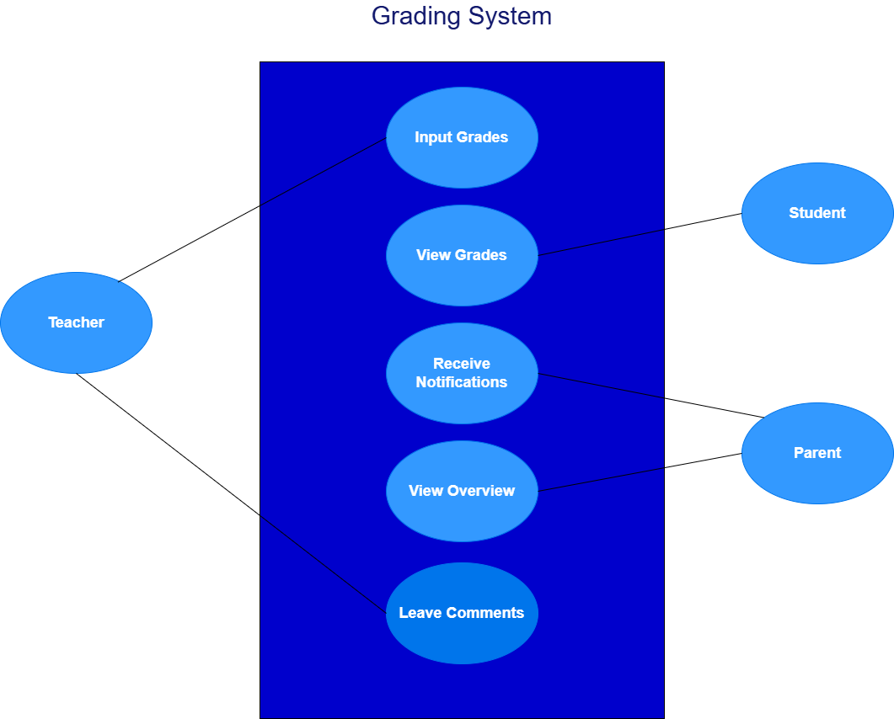

# Software-Planung

## Aufgabe 1  

- **Notenverwaltungssystem**  
- **Use-Case-Diagramm** mit Draw.io zeichnen  
- **5 User-Stories sammeln**  
- **Github-Repository anlegen** (Beide Teammitglieder haben Zugriff)  
- **Projektbeschreibung und Userstories als Markdownfile im Repo** (Readme.md)  
- **Usecase.png in das Repo laden**  
- **Milestone für jede Userstory anlegen**  

### User-Stories  

1. **As a teacher**, I want to input student grades easily so that I can save time and focus on teaching.  
3. **As a student**, I want to view my grades securely so that I can track my academic progress.  
4. **As a parent**, I want to receive notifications about my child's grades so that I can stay informed about their progress.  
5. **As a teacher**, I want to leave comments alongside grades so that I can provide personalized feedback to students.  
6. **As a parent**, I want to access an overview of my child's attendance and submitted assignments so that I can understand their overall academic engagement.  

---

## Aufgabe 2  

- **Github-Project anlegen**  
- **Kanban-Board / View:**  
  - Backlog  
  - Do  
  - Progress  
  - Done  
  - Archive  

- **Für jede Story 3 Issues anlegen und mit dem Milestone verbinden**  
- **Zeit-Estimation schätzen und angeben.**  
- **Einem User zuweisen und ein Datum angeben.**  
- **Die Roadmap-Ansicht anzeigen und verbessern.**  

---

## Aufgabe 3  

- **Recherchieren, wie man ein Issue mit einem Commit automatisch verändern (Closen) kann.
